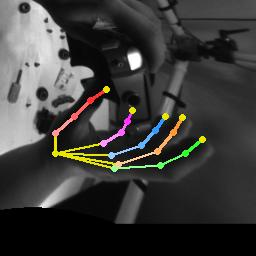
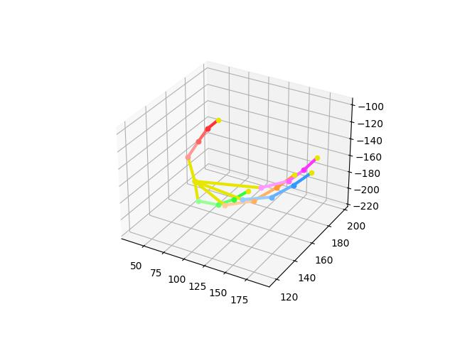
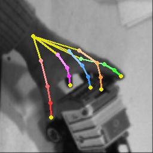
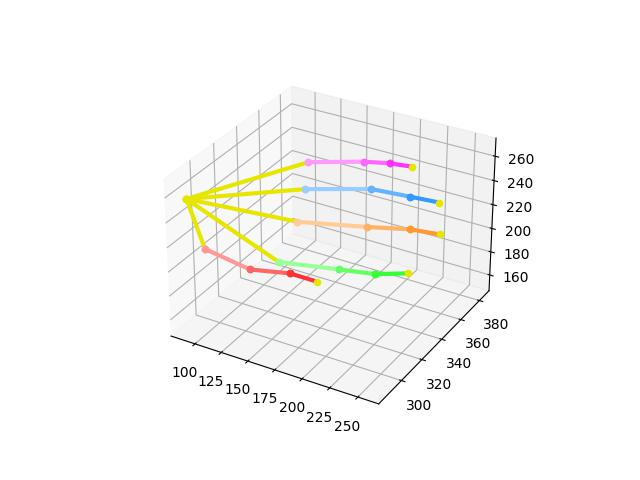
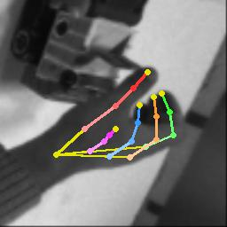
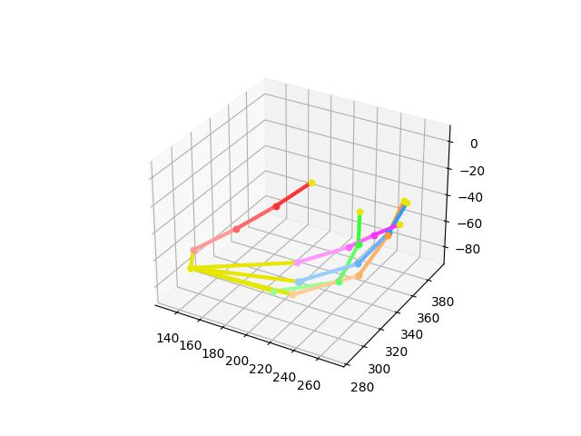
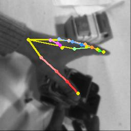
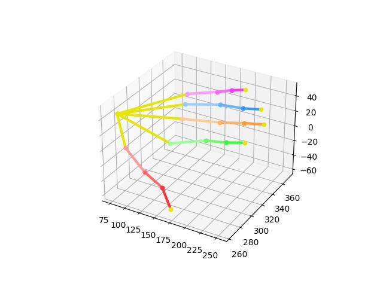

# AssemblyHands Toolkit

AssemblyHands Toolkit is a Python package that provides data loading, visualization, and evaluation tools for the AssemblyHands dataset. 
The dataset and results were originally reported in a CVPR 2023 paper, see below:

**AssemblyHands: Towards Egocentric Activity Understanding via 3D Hand Pose Estimation**\
Takehiko Ohkawa, Kun He, Fadime Sener, Tomas Hodan, Luan Tran, and Cem Keskin\
IEEE/CVF Conference on Computer Vision and Pattern Recognition (CVPR), 2023\
[ [paper](https://openaccess.thecvf.com/content/CVPR2023/papers/Ohkawa_AssemblyHands_Towards_Egocentric_Activity_Understanding_via_3D_Hand_Pose_Estimation_CVPR_2023_paper.pdf) ][ [project page](https://assemblyhands.github.io) ][ [arXiv](https://arxiv.org/abs/tbd) ] 

The dataset is also used in the challenge of the [HANDS workshop](https://sites.google.com/view/hands2023/home) in ICCV 2023.

## Release notes
[May 24, 2023]: Open repository


## Dependency
```
python >= 3.8.11
pytorch >= 1.11.0
```

## Dataset preparation
- Download the assemblyhands dataset from google drive with the access request.\
NOTE: we're preparing data downloading link now. Please wait for a while.
<!-- [[ego images]](https://drive.google.com/drive/folders/10wxNJIw1db2ooHsspKYD1NijGyAe5Ozn?usp=share_link)
[[annotations]](https://drive.google.com/drive/folders/1mPif4HbxfDbmAu7_prsVxqknL7nbJulI?usp=share_link) -->

The number of images for each ego camera is not consistent because we only compressed valid egocentric images by excluding images without hands.

- Assume the assemblyhands data is stored in \${DATA_DIR}. The structure of \${DATA_DIR} is as follows
```
- ${DATA_DIR}
    - images
        - ego_images_rectified
            - split: {test, train, val}        
    - annotations
        - skeleton.txt
        - split: {demo, test, train, val}  
            - assemblyhands_${split}_ego_calib_v1-1.json
            - assemblyhands_${split}_ego_data_v1-1.json
            - assemblyhands_${split}_joint_3d_v1-1.json

```
*These annotation files are too large to read. Please see the `demo` annotations to check the format.

- Link the data and annotations to this codebase.
```
mkdir -p data/assemblyhands
ln -s ${DATA_DIR}/images data/assemblyhands 
ln -s ${DATA_DIR}/annotations data/assemblyhands 
```

## Annotation format
All annotations must be accessible in `data/assemblyhands/annotations/`.

- assemblyhands_${split}_${modality}_data.json: follows [COCO format](https://github.com/open-mmlab/mmpose/blob/master/docs/en/tutorials/2_new_dataset.md) and is used for single-view image loading.
- assemblyhands_${split}_joint_3d.json: contains 3d keypoint anootations.
- assemblyhands_${split}_${modality}_calib.json: stores camera parameters with `intrinsics` and `extrinsics`.

Keypoint order: 0-20 Right, 21-41 Left
```
       (LEFT)              (RIGHT)
  37  33  29  25          4   8  12  16
  |   |   |   |           |   |   |   |
  38  34  30  26          5   9  13  17
  |   |   |   |  21    0  |   |   |   |
  39  35  31  27 |     |  6  10  14  18
  |   |   |   |  22    1  |   |   |   |
  40  36  32  28 |     |  7  11  15  19
   \  \   |   /  23    2  \   |   /  /
    \  \  |  /  /       \  \  |  /  /
     \  \ | /  24        3  \ | /  /
      \  -|-  /           \  -|-  /
          41                 20
```

## Example of data loading and visualization
We have implemented a data loader in `src/dataset/AssemblyHands-Ego` based on the [InterHand2.6M](https://github.com/facebookresearch/InterHand2.6M) code.\
Run the following command to visualize the annotations.
```
python -m src.dataset.AssemblyHands-Ego.dataset
```

|                           |                           |
|:-------------------------:|:-------------------------:|
| |  |
| |  |
| |  |
| |  |


## Citation & license
Please cite the following article if our code helps you.
```
@inproceedings{ohkawa:cvpr23,
    title     = {{AssemblyHands:} Towards Egocentric Activity Understanding via 3D Hand Pose Estimation},
    author    = {Takehiko Ohkawa and Kun He and Fadime Sener and Tomas Hodan and Luan Tran and Cem Keskin},
    booktitle = {Proceedings of the IEEE/CVF Conference on Computer Vision and Pattern Recognition (CVPR)},
    pages     = {12999-13008},
    year      = {2023},
}
```

AssemblyHands Toolkit is CC-BY-NC 4.0 licensed, as found in the LICENSE file.

[[Terms of Use](https://opensource.facebook.com/legal/terms)]
[[Privacy Policy](https://opensource.facebook.com/legal/privacy)]