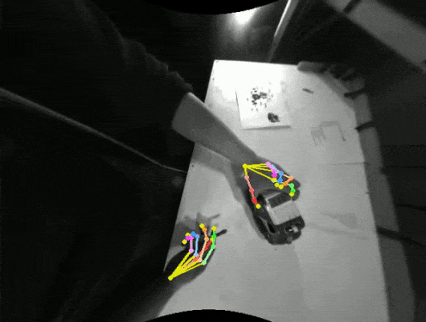
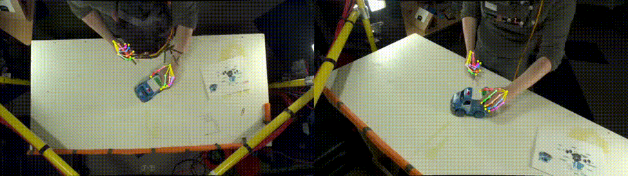
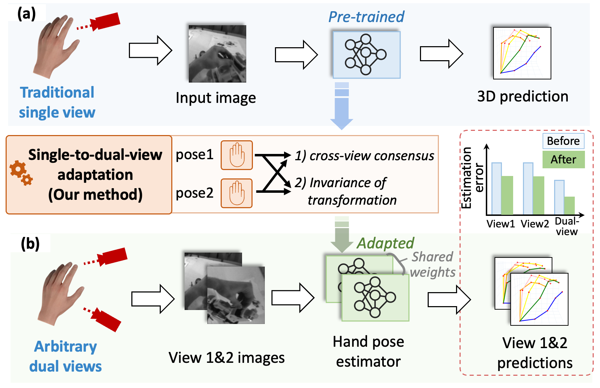

# AssemblyHands Toolkit

AssemblyHands Toolkit is a Python package that provides data loading, visualization, and evaluation tools for the AssemblyHands dataset. 
The dataset and results were originally reported in a CVPR 2023 paper, see below:

**AssemblyHands: Towards Egocentric Activity Understanding via 3D Hand Pose Estimation**\
Takehiko Ohkawa, Kun He, Fadime Sener, Tomas Hodan, Luan Tran, and Cem Keskin\
IEEE/CVF Conference on Computer Vision and Pattern Recognition (CVPR), 2023\
[ [paper](https://openaccess.thecvf.com/content/CVPR2023/papers/Ohkawa_AssemblyHands_Towards_Egocentric_Activity_Understanding_via_3D_Hand_Pose_Estimation_CVPR_2023_paper.pdf) ][ [project page](https://assemblyhands.github.io) ][ [arXiv](https://arxiv.org/abs/tbd) ] 

The dataset is also used in the challenge of the [HANDS workshop](https://sites.google.com/view/hands2023/home) in ICCV 2023.

## Release notes
[Nov 09, 2023]: Add link to exocentric videos and visualizer (the 8 static RGB cameras used in automatic pose annotation).\
[Aug 11, 2023]: Add video visualizer in visualization/visualizer.py \
[Jun 26, 2023]: Update src/common/utils & upload skeleton.txt in the "annotations" folder \
[Jun 26, 2023]: Fix a tar file of "nusar-2021_action_both_9075-c08b_9075_user_id_2021-02-12_101609.tar.gz" in the google drive \
[May 24, 2023]: Open repository


## Dependency
```
python >= 3.8.11
pytorch >= 1.11.0
```

## Dataset preparation
- Download the assemblyhands dataset from google drive.\
[[ego_images]](https://drive.google.com/drive/folders/1CZC0uRSmgHpNXFwXPBRJGcnu7NxWmO6A?usp=sharing)
[[exo_videos]](https://drive.google.com/drive/folders/1e_TIb2et_bBoa15DoBFjDT3pV-Ivqqzl?usp=sharing)
[[annotations]](https://drive.google.com/drive/folders/1mPif4HbxfDbmAu7_prsVxqknL7nbJulI?usp=sharing)

The number of images for each ego camera is not consistent because we only compressed valid images by excluding images without hands.

- Assume the assemblyhands data is stored in \${DATA_DIR}. The structure of \${DATA_DIR} is as follows
```
- ${DATA_DIR}
    - images
        - ego_images_rectified
            - split: {test, train, val}        
    - videos
        - exo_videos_rectified
            - nusar-2021_*
    - annotations
        - skeleton.txt
        - split: {demo, test, train, val}  
            - assemblyhands_${split}_ego_calib_v1-1.json
            - assemblyhands_${split}_ego_data_v1-1.json
            - assemblyhands_${split}_joint_3d_v1-1.json

```

- Link the data and annotations to this codebase.
```
mkdir -p data/assemblyhands
ln -s ${DATA_DIR}/images data/assemblyhands 
ln -s ${DATA_DIR}/videos data/assemblyhands
ln -s ${DATA_DIR}/annotations data/assemblyhands 
```

The files of invalid image list (`invalid_${split}_${modality}.txt`) will be generated when running the `dataset.py` first. With these files, image loading will be faster next time.

## Annotation format
All annotations must be accessible in `data/assemblyhands/annotations/`.

- assemblyhands_${split}_${modality}_data.json: follows [COCO format](https://github.com/open-mmlab/mmpose/blob/master/docs/en/tutorials/2_new_dataset.md) and is used for single-view image loading.
- assemblyhands_${split}_joint_3d.json: contains 3d keypoint anootations.
- assemblyhands_${split}_${modality}_calib.json: stores camera parameters with `intrinsics` and `extrinsics`.

Keypoint order: 0-20 Right, 21-41 Left
```
       (LEFT)              (RIGHT)
  37  33  29  25          4   8  12  16
  |   |   |   |           |   |   |   |
  38  34  30  26          5   9  13  17
  |   |   |   |  21    0  |   |   |   |
  39  35  31  27 |     |  6  10  14  18
  |   |   |   |  22    1  |   |   |   |
  40  36  32  28 |     |  7  11  15  19
   \  \   |   /  23    2  \   |   /  /
    \  \  |  /  /       \  \  |  /  /
     \  \ | /  24        3  \ | /  /
      \  -|-  /           \  -|-  /
          41                 20
```

## Example of data loading and visualization
We have implemented a data loader in `src/dataset/AssemblyHands-Ego` based on the [InterHand2.6M](https://github.com/facebookresearch/InterHand2.6M) code.\
You can run this visualization to check the loaded images and annotations.
```
python -m src.dataset.AssemblyHands-Ego.dataset
```

|                           |                           |
|:-------------------------:|:-------------------------:|
| |  |
| |  |
| |  |
| |  |

## Visualization
### Visualizing egocentric images
This is a script of the frame-wise visualizer loading a two-hand-pose json.
Given the ground-truth or the predictions in world coordinates, you can visualize rectified egocentric images and export them to a video.
```
python -m visualization.visualizer
```


###  Visualizing exocentric videos
This is a script of the video-based visualizer for rectified exocentric videos.
Note that released Assembly101 videos are not syncronized across all views. These rectified videos are syncronized and you can find the detail of this processing in [README](https://drive.google.com/file/d/1ssakEvQPAfNLG1RNLsLRuZsU70gI31tL/view?usp=drive_link).
```
python -m visualization.video_visualizer
```



## Related projects
### Single-to-Dual-View Adaptation for Egocentric 3D Hand Pose Estimation (CVPR 2024)
[[S2DHand]](https://github.com/ut-vision/S2DHand) proposes Single-to-Dual-view adaptation framework to adapt a traditional single-view hand pose estimator to arbitrary dual views. Pretrained single-view estimators are available.




### ICCV 2023 HANDS challenge
This dataset is used in this competition: [[AssemblyHands@ICCV23]](https://sites.google.com/view/hands2023/challenges/assemblyhands). 
Test data and evaluation can be found in [[HANDS2023-AssemblyHands]](https://github.com/ut-vision/HANDS2023-AssemblyHands). Submitted technical reports are compiled into the following report.

[[Benchmarks and Challenges in Pose Estimation for Egocentric Hand Interactions with Objects]](https://arxiv.org/abs/2403.16428): \
Zicong Fan*, Takehiko Ohkawa*, Linlin Yang*, Nie Lin, Zhishan Zhou, Shihao Zhou, Jiajun Liang, Zhong Gao, Xuanyang Zhang, Xue Zhang, Fei Li, Liu Zheng, Feng Lu, Karim Abou Zeid, Bastian Leibe, Jeongwan On, Seungryul Baek, Aditya Prakash, Saurabh Gupta, Kun He, Yoichi Sato, Otmar Hilliges, Hyung Jin Chang, and Angela Yao (* equal contribution)


<!-- 
[A Concise Pipeline for Egocentric Hand Pose Reconstruction](https://drive.google.com/file/d/1C3oizCPxnQhZ_De_P9vZfszoIGUWelK3/view?usp=share_link): \
Team: Zhishan Zhou*, Zhi Lv*, Shihao Zhou, Minqiang Zou, Tong Wu, Mochen Yu, Yao Tang, Jiajun Liang \
Baseline:  ViT-based backbones and a simple regressor for 3D keypoints prediction \
Preprocess: a warp perspective operation to make the hands near the edge less stretched \
Postprocess: selective multi-view fusion, TTA, smoothing, and ensemble

[Multi-View Fusion Strategy for Egocentric 3D Hand Pose Estimation](https://drive.google.com/file/d/1m_oJY0yvJZSLebDBopSL0Hsg0PhN-J_A/view?usp=share_link): \
Team: Zhong Gao, Xuanyang Zhang \
Baseline: heatmap regression and voting \
Techniques: selective Feature Transform Layers for multi-view fusion

[Egocentric 3D Hand Pose Estimation](https://drive.google.com/file/d/1Y9YnbX2jPbXSpmRj5OIOy2txnBTqgAH1/view?usp=share_link): \
Team: Xue Zhang, Jingyi Wang, Fei Li, Rujie Liu \
Baseline: HandOccNet + 2D heatmap regressor \
Postprocess: weighted multi-view fusion -->

## Citation & license
Please cite the following article if our code helps you.
```
@inproceedings{ohkawa:cvpr23,
    title     = {{AssemblyHands:} Towards Egocentric Activity Understanding via 3D Hand Pose Estimation},
    author    = {Takehiko Ohkawa and Kun He and Fadime Sener and Tomas Hodan and Luan Tran and Cem Keskin},
    booktitle = {Proceedings of the IEEE/CVF Conference on Computer Vision and Pattern Recognition (CVPR)},
    pages     = {12999-13008},
    year      = {2023},
}
```

AssemblyHands Toolkit is CC-BY-NC 4.0 licensed, as found in the LICENSE file.

[[Terms of Use](https://opensource.facebook.com/legal/terms)]
[[Privacy Policy](https://opensource.facebook.com/legal/privacy)]
